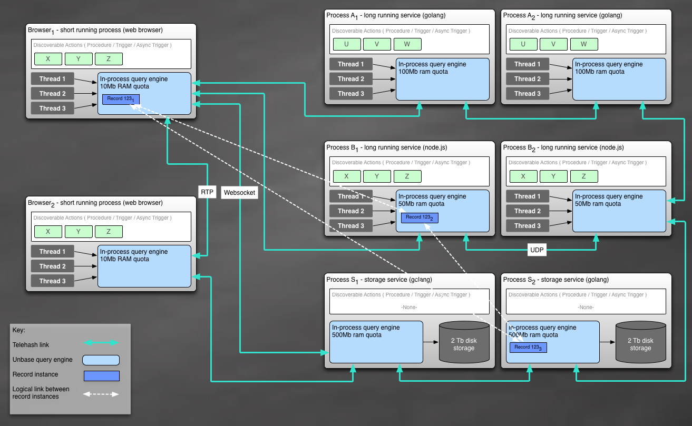

# Design elements

* Maximize concurrency
* Move data inside the process, and closer to the processor
* Integral audit trail
* Integral push-updates
* Integral content-filtered subscriptions
* Integral view rendering

    
# Possible Consistency Models

## Causal Tree - A form of strong eventual consistency

Each object is comprised of a series of edit atoms, each of which corresponds to the creation, amendment, or deletion of the object.
Question: Is each of the fields in the edit object necessarily a CRDT?

When an edit is commenced, a transaction ID is generated which is guaranteed to be unique.
Each transaction ID in the below table is in the format of: Node ID.Transaction Counter
The first edit atom is called 

| Object ID | Trans ID  | Parent Trans IDs | Payload 
| --------- | --------- | -----------------| -------
| 123       | A.1       | NULL             | foo=1
| 123       | A.2       | A.1              | foo=3
| 123       | B.1       | A.1              | foo=9
| 123       | B.2       | A.2, B.1         | foo=9

The Working copy of the object maintains a pre-calculated representation of it's values.
Whenever a new edit atom is replicated from another server, its parent trans ID is compared to the Trans ID(s) at the tail of the object.
If this transaction does not match, recurse through the edit atoms by their Parent Trans ID.
Once the matching Parent Trans ID is found, evaluate it, and the subsequent edit atoms in a deterministic and Convergent / Commutative fashion, and update the working copy of the object.

Occasionally, if an extremely old atom is replicated, it may become necessary to recurse quite deeply into the historical edit atoms, however; in general
The assumption in this model is that most replication will be completed relatively expediently, and that the parent transaction of the replicated atom will
usually match the Trans ID in the working copy of the object, or have to recurse relatively few times. If an atom corresponding to the parent Trans ID is not found,
the presumption is that the replicated atom arrived out of order, and must be stored until such time as the connecting atoms have appeared.

* Consider fetching connecting atoms from the replicator
* How to handle No-Earlier-Than?
* Consider using timestamp to limit recursion for non-matched atoms?
* Atoms could be LFUd out to a deep storage node

# Distance Buckets (Work in progress)

[Location location location][what_is_distance]

In a majority of database use cases, ensuring that data is consistent, and persistent is of paramount importance.
Conventional databases employ synchronous replication to ensure that writes are commited to a quorem of relevant database
nodes before considering the transaction successful. This makes sense in many cases, but the unconditional application of this approach
is too conservative to meet our ambitious design goals. Unbase seeks to achieve tunable consistency at the schema level, offering multiple
different standards of consistency to choose from.
When network disruptions occur

Unbase shall also maintain a set of buckets into which node IDs are placed Similar to the bucket system maintained by kademlia
